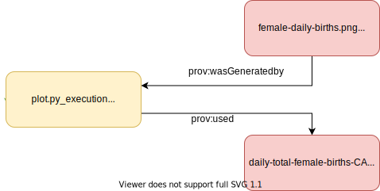

# ProvONE Example

### Use Case:
A researcher wants to produce a plot showing the contents of a data file for a publication. The researcher wants to capture as much provenance information as possible and display it in ProvONE.

Script Name: `plot.py`
Input File: `daily-total-female-births.csv`
Output File, `female-daily-births.png`

See the files on GitHub [here](https://github.com/ThomasThelen/prov-examples)


## As Minimal W3C Prov


The minimal W3C Prov description is straight forward: we link inputs and outputs to the script execution.

Note that this model is incomplete and that `plot.py` _isn't_ referenced anywhere. `plot.py_execution` is an object that represents the actual running of `plot.py` rather than the script itself.

This can be read as
The execution, `plot.pt_execution` used `daily-total-female-births-CA.csv` and `female-daily-births.png` was generated by the execution.


_not_ as
The program `plot.py` used `daily-total-female-births-CA.csv` and `female-daily-births.png` was generated from it.
```json
{
   "@context":[
      {
         "prov":"http://www.w3.org/ns/prov#"
      }
   ],
   "@graph":[
      {
         "@id":"plot.py_execution",
         "@type":"prov:Activity",
         "prov:used":"daily-total-female-births-CA.csv"
      },
      {
         "@id":"daily-total-female-births-CA.csv",
         "@type":"prov:Entity"
      },
      {
         "@id":"female-daily-births.png",
         "@type": "prov: Entity",
         "prov:wasGeneratedBy":"plot.py_execution"
      }
   ]
}
```


## As Minimal ProvONE


The most basic ProvONE representation is similar to prov. The most we can do without adding anything is by using some ProvONE types that can be used to further specify _what_ things are.

In this case, there are only two that need modification:
1. prov: Activity -> `provone:Execution`
1. prov:Entity -> `provone:Data`


```json
{
   "@context":[
      {
         "prov":"http://www.w3.org/ns/prov#"
      },
      {
         "provone":"http://purl.dataone.org/provone/2015/01/15/ontology#"
      }
   ],
   "@graph":[
      {
         "@id":"plot.py_execution",
         "@type":"provone:Execution",
         "prov:used":"daily-total-female-births-CA.csv"
      },
      {
         "@id":"daily-total-female-births-CA.csv",
         "@type":"provone:Data"
      },
      {
         "@id":"female-daily-births.png",
         "@type": "prov: Entity",
         "prov:wasGeneratedBy":"plot.py_execution"
      }
   ]
}

```

### Adding a Record for `plot.py`


To add `plot.py`, we 
    1. Create a `provone:Program` to represent `plot.py`
    1. Connect the `provone:Program` to its `provone:Execution` via an intermediary `qulifiedAssociation` relationship
    

This can be read as

The execution, `plot.py_execution`, was associated with a plan, `associated_plan`, given by `plot.py`.


```json
{
   "@context":[
      {
          "prov":"http://www.w3.org/ns/prov#"
      },
      {
          "provone":"http://purl.dataone.org/provone/2015/01/15/ontology#"
      }
   ],
   "@graph":[
      {
          "@id":"plot.py_execution",
          "@type":"provone:Execution",
          "prov:used":"daily-total-female-births-CA.csv",
          "prov:qualifiedAssociation": "associated_plan"
      },
      
      {
          "@id": "associated_plan",
          "@type": "Association",
          "provone:hadPlan": "plot.py"
      },
      
      {
          "@id": "plot.py",
          "@type": "provone:Program"
      },
      
      {
          "@id":"daily-total-female-births-CA.csv",
          "@type":"provone:Data"
      },
      
      {
          "@id":"female-daily-births.png",
          "@type": "prov: Entity",
          "prov:wasGeneratedBy":"plot.py_execution"
      }
   ]
}
```

## With Usage Ports


The `plot.py` object is fairly abstract, and like its execution, we can attach inputs and outputs. Like `plot.py` these are abstract references that can be linked back to `prov: Entity` or `provone: Data` types.

One way to read it follows,
This program, `plot.py` uses an external resource, represented as `birth_data_port`, and this particular execution, `plot.py_execution`, gave it `daily-total-female-births-CA.csv`.

To add a port representing input data,
1. Create a `provone: Port`
2. Create a `provone: Usage`
3. Link the `provone: Execution` to `provone: Usage` with `prov: qualifiedUsage`
4. Link the `provone: Usage` to the `provone: Port` with `provone: hadInPort`
5. Link the `provone: Program` to the `provone: Port` with `provone: hasInPort`
6. If a `provone: Data` or `prov: Entity` that represents this `provone: Port` exists, link the `provone: Port` to it with `prov: hadEntity`


```json
{
   "@context":[
      {
          "prov":"http://www.w3.org/ns/prov#"
      },
      {
          "provone":"http://purl.dataone.org/provone/2015/01/15/ontology#"
      }
   ],
   "@graph":[
      {
          "@id":"plot.py_execution",
          "@type":"provone:Execution",
          "prov:used":"daily-total-female-births-CA.csv",
          "prov:qualifiedAssociation": "associated_plan",
          "prov:qualifiedGeneration": "birth_plot_generation"
      },
      
      {
          "@id": "associated_plan",
          "@type": "Association",
          "provone:hadPlan": "plot.py"
      },
      
      {
          "@id": "plot.py",
          "@type": "provone:Program",
          "provone:hasOutPort": "birth_plot_port"
      },
      
      {
          "@id": "birth_plot_generation",
          "@type": "provone:Generation",
          "provone:hadOutPort": "birth_plot_port"
      },
      
      {
          "@id": "birth_plot_port",
          "@type": "provone:Port"
      },
      
      {
          "@id":"daily-total-female-births-CA.csv",
          "@type":"provone:Data"
      },
      
      {
          "@id":"female-daily-births.png",
          "@type": "prov: Entity",
          "prov:wasGeneratedBy":"plot.py_execution"
      }
   ]
}
```

## With Generation Ports
Adding generation ports uses the same workflow as adding input ports however, instead of a `provone: Usage` we use a `provone: Generation`.

To add a port representing input data,
1. Create a `provone: Port`
2. Create a `provone: Generation`
3. Link the `provone: Execution` to `provone: Generation` with `prov: qualifiedGeneration`
4. Link the `provone: Generation` to the `provone: Port` with `provone: hadOutPort`
5. Link the `provone: Program` to the `provone: Port` with `provone: hasOutPort`
6. If a `provone: Data` or `prov: Entity` that represents this `provone: Port` exists, link the `provone: Generation` to it with `prov: hadEntity`


```json
{
   "@context":[
      {
          "prov":"http://www.w3.org/ns/prov#"
      },
      {
          "provone":"http://purl.dataone.org/provone/2015/01/15/ontology#"
      }
   ],
   "@graph":[
      {
          "@id":"plot.py_execution",
          "@type":"provone:Execution",
          "prov:used":"daily-total-female-births-CA.csv",
          "prov:qualifiedAssociation": "associated_plan",
          "prov:qualifiedGeneration": "birth_plot_generation"
      },
      
      {
          "@id": "associated_plan",
          "@type": "Association",
          "provone:hadPlan": "plot.py"
      },
      
      {
          "@id": "plot.py",
          "@type": "provone:Program",
          "provone:hasOutPort": "birth_plot_port",
          "provone:hasInPort": "birth_usage_port"
      },
      
      {
          "@id": "birth_plot_generation",
          "@type": "provone:Generation",
          "provone:hadOutPort": "birth_plot_port"
      },
      
      {
          "@id": "birth_plot_port",
          "@type": "provone:Port"
      },
      
      {
          "@id": "female_births_usage",
          "@type": "provone:Usage",
          "provone:hadInPort": "birth_usage_port",
          "provone:hadEntity:": "daily-total-female-births-CA.csv"
      },      
      
      {
          "@id": "birth_usage_port",
          "@type": "provone:Port"
      },
      {
          "@id":"daily-total-female-births-CA.csv",
          "@type":"provone:Data"
      },
      
      {
          "@id":"female-daily-births.png",
          "@type": "prov: Entity",
          "prov:wasGeneratedBy":"plot.py_execution"
      }
   ]
}
```
